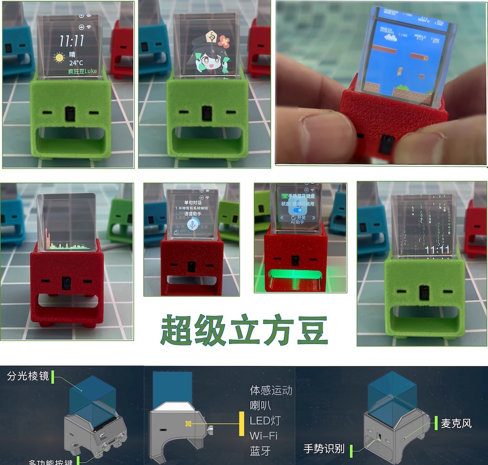

# 超级立方豆。

## About
超级立方豆，是一款小巧、炫酷的桌面智能助手， 由疯狂豆Luke、助手小A、大L 共同完成。  
硬件集成: 分光棱镜、红外手势识别、多功能按钮、运动传感器、麦克风、LED灯、喇叭、芯片为 ESP32-Pico-V3-2。  
综合利用硬件资源开发了各种有趣APP应用。   

## 项目介绍视频
* 第二期 [完整的一身](https://www.bilibili.com/video/BV1Xs4y1A7rm)
* 第一期 [项目起源](https://www.bilibili.com/video/BV1oe411L7X8)

## 项目开源

* [1.软件开发框架 CrazyCube-AppOS](https://github.com/crazy-luke/crazycube)

* [2.硬件制作 CrazyCube-Hardware](https://github.com/crazy-luke/CrazyCube-hardware)

* [3.一键烧录 CrazyCube-Flasher](https://github.com/crazy-luke/CrazyCube-Flasher)

## 直接购买
暂时保留代工地址 [氪金购买](https://item.taobao.com/item.htm?id=714746934007)

## 固件更新（请见 firmware 目录）
*    股市：可以查看自己关注的 股票行情：这是来自一位想要上班“摸鱼”的朋友需求 （V1.6.0新增）
*  Cubot：机器人表情 + 幸运数字抽奖：这是在B站上有趣的抽奖开发的 （V1.4.0新增）
*  FlappyBird: 按钮控制小鸟游戏，这是来一位小电视爱好者的需求（V1.4.0新增）
*  FC 游戏：红白游戏机模拟器，可自己上传ROM，陀螺仪+按钮 控制。
*  动感频谱：麦克风音频转换为频谱。
*  桌面: 天气、时间、签名、骇客帝国屏保
*  完美Gif: 无需转码工具可直接显示 Gif文件
*  相册：显示照片
*  播客: 网络音频播放器，地址可自定义。
*  Bilibili: 自动下载UP头像（不需要手动上传照片）和粉丝
*  AI助手：ChatGPT 语音聊天
*  轻松一刻：陀螺仪控制贪食蛇和小蜜蜂游戏。
*  蓝牙手势键盘：手势操作转换为蓝牙键盘，控制电脑、Pad灯。
*  系统设置：配置超级立方豆
*  其他：APP 收纳盒、立方豆手册、姿态控制

## 使用说明

* [1.基础操作](https://www.bilibili.com/video/BV1WM411G74T)
* [2.进阶操作](https://www.bilibili.com/video/BV1Vk4y1n7Rx)
* [3.FC游戏机](https://www.bilibili.com/video/BV1nT411h7Av) 
* [4.高阶操作](https://www.bilibili.com/video/BV17o4y1A74J)

## 支持 与 声明
1. 超级立方豆硬件集成度较高，软件框架暂时还没时间写向导，新手排错可能有一定难度，如有疑问可以私信 B站 疯狂豆Luke 或者加小A的QQ 10900204
2. 本项目仅供个人学习使用，未经允许不得用于任何商业用途。

## License

 This work is licensed under a <a rel="license" href="http://creativecommons.org/licenses/by-nc-nd/4.0/">Creative Commons Attribution-NonCommercial-NoDerivatives 4.0 International License</a>.

Copyright © 2023, 疯狂豆® 