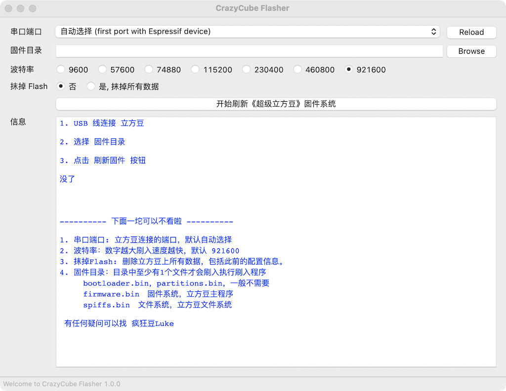

# 超级立方豆固件

##固件简要说明
*  Cubot：机器人表情 + 幸运数字抽奖 （V1.4.0新增）
*  FlappyBird: 按钮控制小鸟游戏 （V1.4.0新增）
*  FC 游戏：红白游戏机模拟器，可自己上传ROM，陀螺仪+按钮 控制。
*  动感频谱：麦克风音频转换为频谱。
*  桌面: 天气、时间、签名、骇客帝国屏保
*  完美Gif: 无需转码工具可直接显示 Gif文件
*  相册：显示照片
*  播客: 网络音频播放器，地址可自定义。
*  Bilibili: 自动下载UP头像（不需要手动上传照片）和粉丝
*  AI助手：ChatGPT 语音聊天
*  轻松一刻：陀螺仪控制贪食蛇和小蜜蜂游戏。
*  蓝牙手势键盘：手势操作转换为蓝牙键盘，控制电脑、Pad灯。
*  系统设置：配置超级立方豆
*  其他：APP 收纳盒、立方豆手册、姿态控制

## 使用说明

* [1.基础操作](https://www.bilibili.com/video/BV1WM411G74T)
* [2.进阶操作](https://www.bilibili.com/video/BV1Vk4y1n7Rx)
* [3.FC游戏机](https://www.bilibili.com/video/BV1nT411h7Av) 
* [4.高阶操作](https://www.bilibili.com/video/BV17o4y1A74J)

## 更新固件方法
1. 下载烧录程序
 	* Windows（Win10 以上）版：CrazyCube-Flasher.exe
	* Mac 版：CrazyCube-Flasher.dmg
2. 升级固件
	* USB2.0 线连接电脑和超级立方豆。
	* 点击 Browser 按钮选择固件所在文件夹（比如 bin/v1.4.0）
	* 点击 “开始刷新《超级立方豆》固件系统” 按钮开始升级

